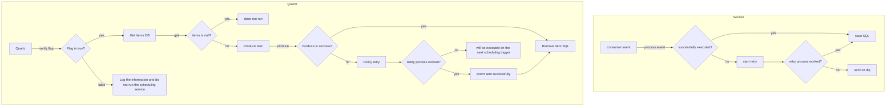
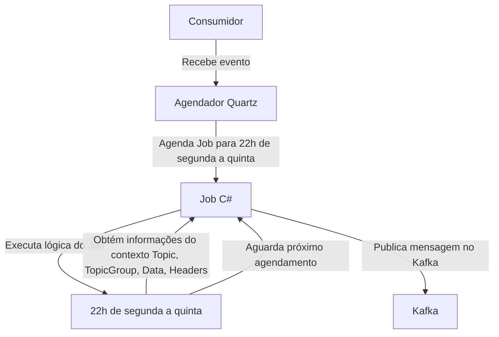

```mermaid
flowchart TD
subgraph Worker;
    A[consumer event] -->|process event| B{successfully executed?}
    B --> |yes| C[save SQL]
    B -->|no| D[start retry]
    D --> E{retry process worked?}
    E --> |yes| C
    E --> |no| F[send to dlq]
end;

subgraph Quartz;
    G[Quartz] --> |verify flag| H{Flag is true?}
    H --> |yes| I[Get items DB]
    I --> |get| M{items is null?}
    M --> |yes| S[does not run]
    M --> |no| K[Produce item]
    H --> |false| J[Log the information and do not run the scheduling service]
    K --> |produce| L{Produce is success?}
    L --> |yes| N[Remove item SQL]
    L --> |no| O[Policy retry]
    O --> P{Retry process worked?}
    P --> |no| Q[will be executed on the next scheduling trigger]
    P --> |yes| R[event sent successfully]
    R --> N
end;
```

```mermaid
graph TD;
    A[Consumidor] -->|Recebe evento| B[Agendador Quartz]
    B -->|Agenda Job para 22h de segunda a quinta| C[Job C#]
    C -->|Executa lógica do Job| D[22h de segunda a quinta]
    D -->|Obtém informações do contexto Topic, TopicGroup, Data, Headers| C
    C -->|Publica mensagem no Kafka| E[Kafka]
    D -->|Aguarda próximo agendamento| C

```