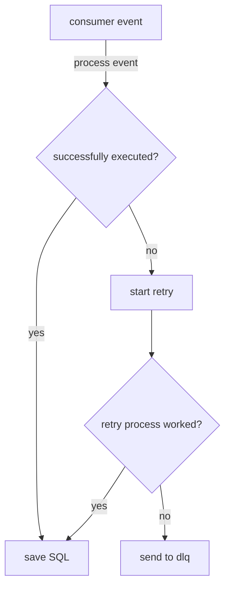

```mermaid
flowchart TD
    A[consumer event] -->|process event| B{successfully executed?}
    B --> |yes| C[save SQL]
    B -->|no| D[start retry]
    D --> E{retry process worked?}
    E --> |yes| C
    E --> |no| F[send to dlq]

```