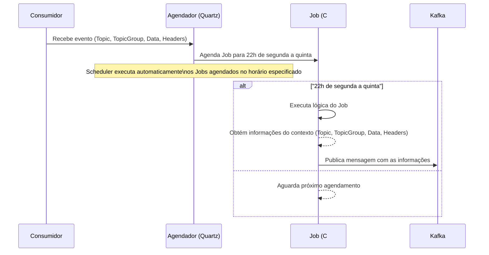

```mermaid
sequenceDiagram
    participant Consumer as Consumidor
    participant Scheduler as Agendador (Quartz)
    participant Job as Job (C#)

    Consumer->>Scheduler: Recebe evento (Topic, TopicGroup, Data, Headers)
    Scheduler->>Job: Agenda Job para 22h de segunda a quinta

    Note over Scheduler: Scheduler executa automaticamente\nos Jobs agendados no horário especificado

    alt "22h de segunda a quinta"
        Job->>Job: Executa lógica do Job
        Job-->>Job: Obtém informações do contexto (Topic, TopicGroup, Data, Headers)
        Job->>Kafka: Publica mensagem com as informações
    else
        Job-->>Job: Aguarda próximo agendamento
    end

```